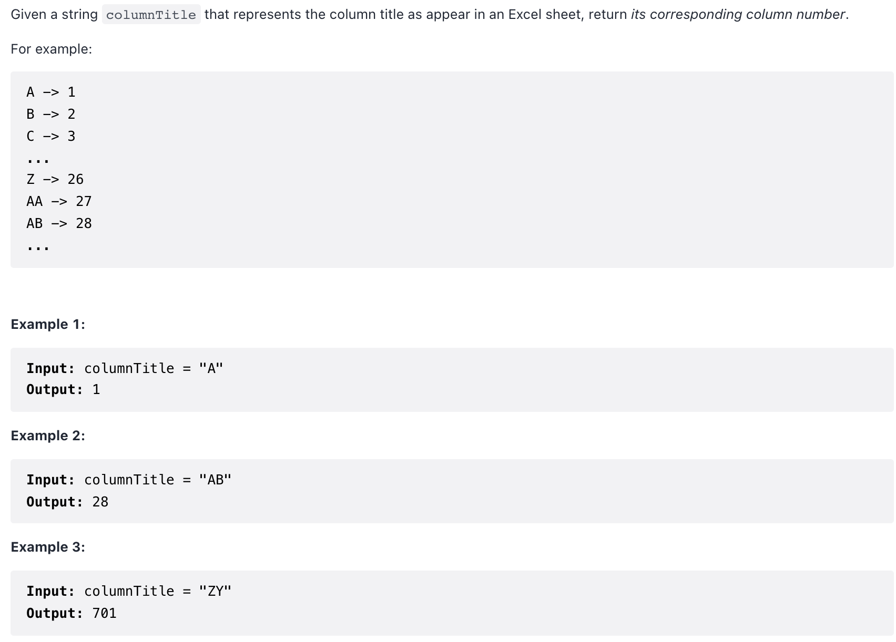

```c++
class Solution {
public:
    // 26进制转10进制
    int titleToNumber(string columnTitle) {
        int res = 0;
        int num = columnTitle.size() - 1;
        for (int i = num; i >= 0; i--) {
            res = (columnTitle[i] - 'A' + 1) * pow(26, double(num - i)) + res;
        }
        return res;
    }
};
```