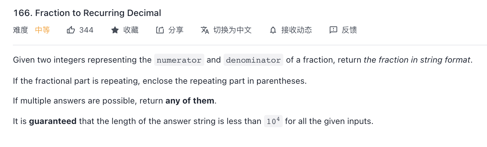

```c++ 
class Solution {
public:
    string res;
    vector<int> dicimals;
    unordered_map<int, int> map; // num, index
    typedef long long ll;
    // -2^31 <= numerator, denominator <= 2^31 - 1
    // -2147483648 / -1
    string fractionToDecimal(int numerator, int denominator) {
        bool minus = numerator < 0 && denominator > 0  || numerator > 0 && denominator < 0? true : false; 
        ll a = abs(numerator);
        ll b = abs(denominator);
        res = to_string(a / b);
        if (a % b == 0) return minus ? "-" + res : res;
        res = res + '.';
        dfs(a % b, b);
        return minus ? "-" + res : res;
    }
    void dfs(ll numerator, ll denominator) {
        ll rest = numerator * 10;
        int Interger = rest / denominator;
        if (!map.count(rest)) {
            // 被除数不存在
            map[rest] = dicimals.size(); dicimals.push_back(Interger);
        }
        else { 
            // 被除数重复 找重复子串
            for (int i = 0; i < dicimals.size(); i++) {
                if (i == map[rest]) res += '(' + to_string(dicimals[i]);
                else  res = res + to_string(dicimals[i]);
            }
            res += ')';
            return;
        }
        ll d = rest % denominator;
        if (d == 0) {
            for (int i = 0; i < dicimals.size(); i++) {
                res += to_string(dicimals[i]);
            }
            return;
        };
        dfs(d, denominator);
    }
};
// 11 / 14 
// hashmap {numerator, dicimals's index }
// 11 / 14 => 0 rest 11
// 110 / 14 => 7 => rest 12
// 120 / 14 -> 8 -> rest 8
// 80 / 14 -> 5 -> 10
// 100 / 14 -> 7 -> 2
// 20 /14 ->   1  -> 6
// 60 / 14 ->  4 -> 4
// 40 / 14 ->  2 -> 12
// 120 // if the numerator is duplicate, from hashmap get the index, i at the dicimals Array. (i..size)
```