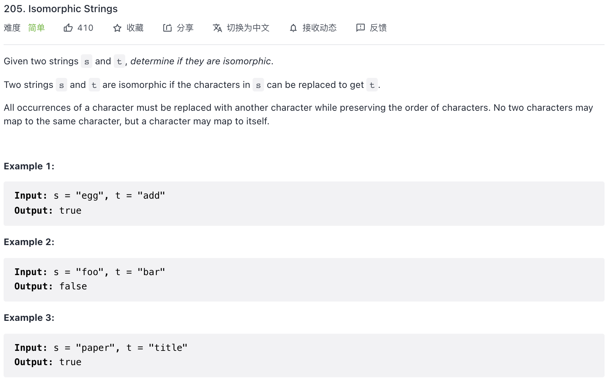

need prove;

以 s 为基准, t 为映射.  将 t 的 char 映射到 s 的 char 
例如, 例二:
f 对应 b
其次. 一个字符只能映射一次;
所以需要记录 visited
//  wa1; "badc" "baba"

```c++
class Solution {
public:
    unordered_map<char, char> map;
    unordered_map<char, bool> visited;
    bool isIsomorphic(string s, string t) {
        if (s.size() != t.size()) return false;
        for (int i = 0; i < s.size(); i++) {
            char c1 = s[i];
            char c2 = t[i];
            if (!map.count(c1)) {
                map[c1] = c2;
                if (!visited.count(c2))visited[c2] = true; /
                else return false;
            } else {
                if (map[c1] != c2) return false;
            }
        }
        return true;
    }
};
```

======>

```c++
class Solution {
public:
    bool isIsomorphic(string s, string t) {
        unordered_map<char, char> map1;
        unordered_map<char, char> map2;
        for (int i = 0, j = 0; i < s.size(); i++, j++) {
            if (map1.find(s[i]) == map1.end()) { // map1保存s[i] 到 t[j]的映射
                map1[s[i]] = t[j];
            }
            if (map2.find(t[j]) == map2.end()) { // map2保存t[j] 到 s[i]的映射
                map2[t[j]] = s[i];
            }
            // 发现映射 对应不上，立刻返回false
            if (map1[s[i]] != t[j] || map2[t[j]] != s[i]) {
                return false;
            }
        }
        return true;
    }
};
```