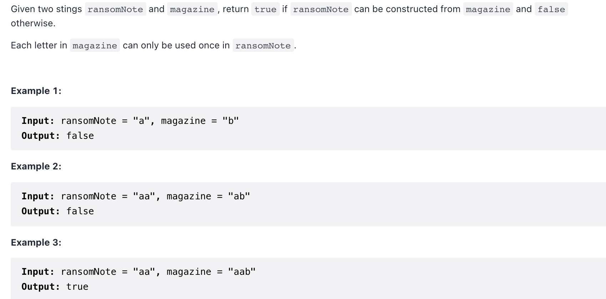

[383. Ransom Note](https://leetcode-cn.com/problems/ransom-note/)



```c++
// ransomNote can be constructed by magazine

class Solution {
public:
    bool canConstruct(string ransomNote, string magazine) {
        int i = 0; int j = 0;
        int hash[26] = {0};
        for (auto& c:magazine) {
            // 通过hash数据记录 magazine里各个字符出现次数
            hash[c - 'a'] += 1;
        }
        for (auto& c:ransomNote) {
            // 遍历ransomNote，在hash里对应的字符个数做--操作
            hash[c - 'a'] -= 1;
            if (hash[c - 'a'] < 0) return false;
        }
        return true; 
    }
};
```