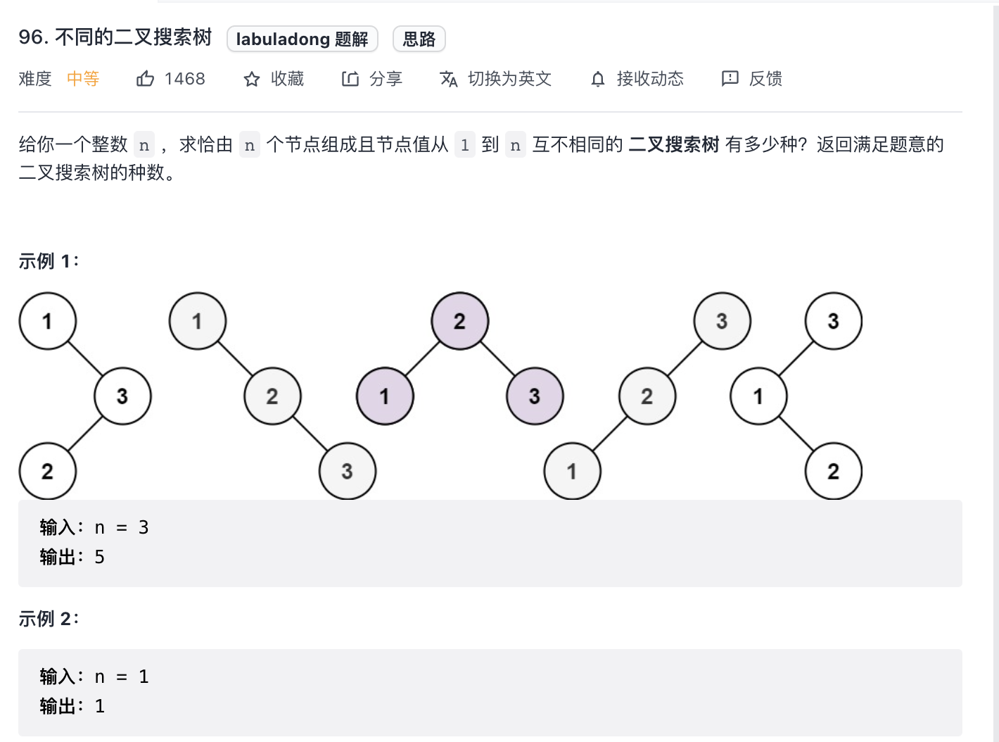
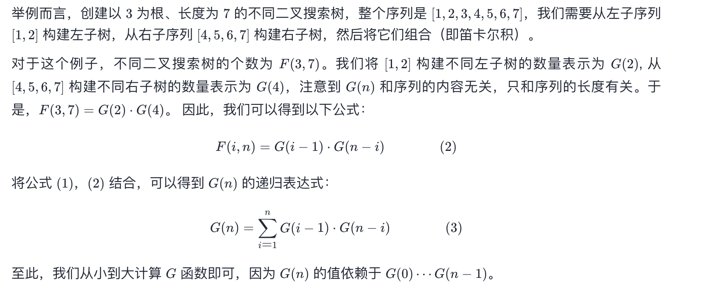

# 96. 不同的二叉搜索树

Medium

## 方法一: 递归


```c++
class Solution {
public:
    vector<vector<int>> memo;
    int numTrees(int n) {
        memo.resize(n + 1, vector<int>(n + 1, 0));
        return count(1, n);
    }
    int count(int lo, int hi) {
        // 以 i 作为 根节点. 小于 i 的作为 leftNodes. 大于 i 的作为 rightNodes.
        // 当 lo > hi. 例如 i = 1.  leftNodes 属于 (lo, i - 1) => (1, 0). 因此 leftNodes 为空节点, 只有一种情况.
        if (lo > hi) return 1;
        // 查询备忘录. 消除重复子节点.
        if (memo[lo][hi] != 0) return memo[lo][hi];
        int res = 0;
        for (int root = lo; root <= hi; root++) {
            int left = count(lo, root - 1);
            int right = count(root + 1, hi);
            res += left * right;
        }
        memo[lo][hi] = res;
        // memo(lo,hi): 以 ii 为根、序列长度为 nn 的不同二叉搜索树个数
        return res;
    }
};
```

## 方法二: 动态规划


```c++
class Solution {
public:
    int numTrees(int n) {
        vector<int> G(n + 1, 0);
        G[0] = 1;
        G[1] = 1;

        for (int i = 2; i <= n; ++i) {
            for (int j = 1; j <= i; ++j) {
                G[i] += G[j - 1] * G[i - j]; // 方法一的: left * right 的扩展.
            }
        }
        return G[n];
    }
};
```

### 方法三: 卡塔兰数
```c++
class Solution {
public:
    int numTrees(int n) {
        long long C = 1;
        for (int i = 0; i < n; ++i) {
            C = C * 2 * (2 * i + 1) / (i + 2);
        }
        return (int)C;
    }
};

```
