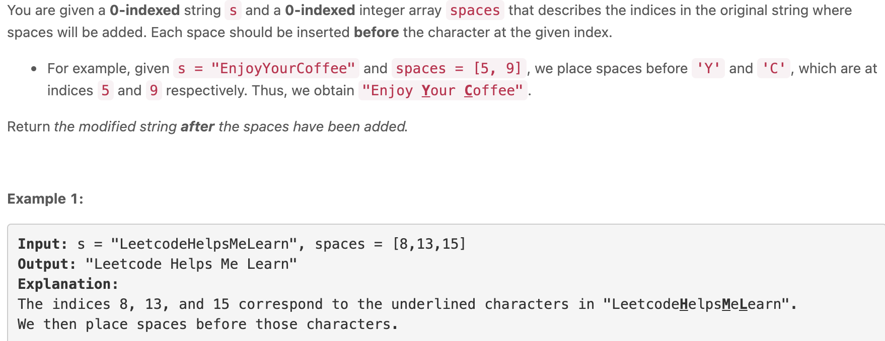

```c++
class Solution {
public:
    string addSpaces(string s, vector<int>& spaces) {
        string res;
        int index = 0;
        for (int i = 0; i < s.size();i++) {
            if (index < spaces.size() && i == spaces[index]) {
                res.push_back(' ');
                index++;
                i = i - 1;
            }
            else res.push_back(s[i]);
        }
        return res;
    }
};
```