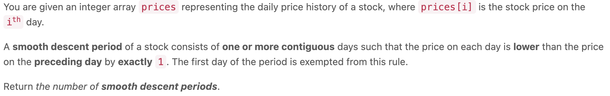

5958. Number of Smooth Descent Periods of a Stock


```c++ 
class Solution {
public:
    long long getDescentPeriods(vector<int>& prices) {
        typedef long long ll;
        vector<ll> dp(prices.size(), 1);
        // prices = [3,2,1,4]
        // dp = [3, 2, 1, 1]
        for (int i = prices.size() - 2; i >= 0; i--) {
            dp[i] = prices[i] - 1 == prices[i+1] ? dp[i] + dp[i+1] : dp[i];
        }
        return accumulate(dp.begin(), dp.end(), 0ll);
        // wa1 , 0ll 限定 longlong 类型
    }
};
```